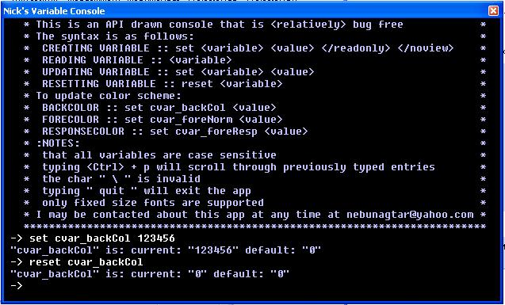



## API Drawn Console App with variable handling \(updated June,5 2003\)

### Description

This app works like DOS. However, it currently only supports variable modifying commands (such as 'set', 'reset'). It works in much the same way as id's engines manipulate and use their variables. I wrote it to include it in a game engine I'm fiddling with or more to the point, to a script parser I'm writing for the game engine. It's sort of a work in progress at the moment with lots of room for expansion (like maybe a binary search for the variable look-ups, or put some commands in it). If you like it vote for it! Enjoy. UPDATE 1: I added command and constant processing ability. I wrote the procedures for each as straight forward and as easily modifyable as I could. Enjoy.
 
### More Info
 
None?

             |
---                |---
**Submitted On**   |2003-06-05 00:15:50
**By**             |[Sintor](https://github.com/Planet-Source-Code/PSCIndex/blob/master/ByAuthor/sintor.md)
**Level**          |Intermediate
**User Rating**    |5.0 (10 globes from 2 users)
**Compatibility**  |VB 6\.0
**Category**       |[String Manipulation](https://github.com/Planet-Source-Code/PSCIndex/blob/master/ByCategory/string-manipulation__1-5.md)
**World**          |[Visual Basic](https://github.com/Planet-Source-Code/PSCIndex/blob/master/ByWorld/visual-basic.md)
**Archive File**   |[API\_Drawn\_159684652003\.zip](https://github.com/Planet-Source-Code/sintor-api-drawn-console-app-with-variable-handling-updated-june-5-2003__1-45944/archive/master.zip)

